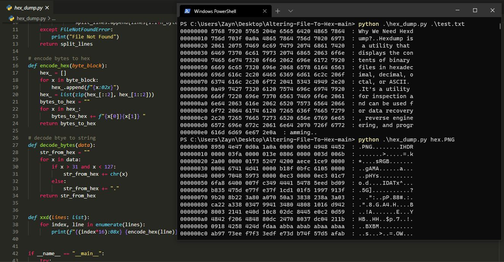
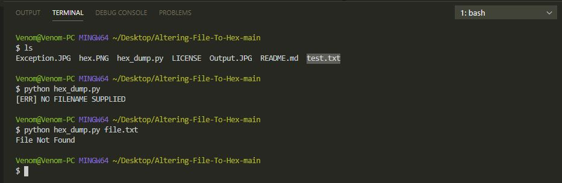

# Altering-File-To-Hex
HexDump Using Python! 

### HOW TO RUN?
    I have tested this program using imagefile(hex.PNG) and a textfile(test.txt).

-----------------------------------
###       W I N D O W S
-----------------------------------
- open command prompt
- navigate to  file path
- type the following command
>python hex_dump.py "filename"  
>python hex_dump.py "imagename"  
-----------------------------------
###         L I N U X
-----------------------------------
- open terminal
- navigate to file path
- type the following command
>python3 hex_dump.py "filename"  
>python3 hex_dump.py "imagename"  

#### RESULT

#### Exceptions

   
####
